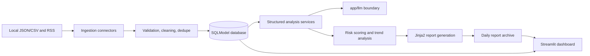

# Architecture

## Overview

The system uses a modular Python architecture:

## Backend

FastAPI is the system API boundary. PR #1 exposes `/health` and a placeholder module route. Later PRs will add ingestion, analysis, risk, report, and evaluation endpoints.

## Ingestion And Preprocessing

The ingestion layer exposes a connector protocol and concrete local JSON, local CSV, and RSS/XML connectors. Connectors return raw payloads; preprocessing handles text cleaning, lightweight language detection, content hashing, dedupe keys, and data quality issues before persistence.

## Database

SQLModel is used for Python typing and SQLAlchemy compatibility. SQLite is the local default through `DATABASE_URL`, while PostgreSQL-compatible connection strings are accepted for later deployment.

Persisted entities include sources, ingestion batches, articles, comments, data quality records, analysis runs, sentiment results, viewpoints, topic summaries, risk insights, recommendations, reports, evaluation runs, and evaluation metrics.

The current repository provides lightweight repository helpers for CRUD-style persistence tests and early services. Full query services can be added only when a downstream module needs them.

## LLM Boundary

All real provider calls must be implemented under `app/llm`. Other modules depend on contracts and client interfaces, not provider SDKs. The current implementation provides deterministic mock structured analysis and an OpenAI client abstraction that intentionally refuses real calls until the provider integration PR.

## Structured Analysis

The analysis service builds evidence items from persisted articles and comments, sends them through the isolated LLM client, validates strict Pydantic outputs, and persists sentiment results, viewpoints, topic summaries, risk insights, and recommendations with evidence IDs.

## Risk Scoring

The risk layer computes deterministic scores from persisted analysis outputs and source evidence. It combines negative sentiment ratio, topic growth, high-engagement negative comments, sensitive-topic signals, and uncertainty, then writes the score and severity back to `risk_insights`.

## Dashboard

Streamlit provides the analyst-facing UI. The dashboard is Chinese-facing and uses backend APIs rather than accessing provider SDKs or databases directly. The `/api/v1/dashboard/summary` endpoint serves date-filtered report archives plus the latest completed analysis run, including sentiment distribution, risk ranking, topic ranking, representative evidence, and run metadata.

## Reporting

The reporting layer assembles completed analysis runs with persisted risks, topics, viewpoints, recommendations, and source evidence. It validates that every referenced evidence ID resolves to an article or comment before persisting a `DailyReport`, then renders Markdown and HTML artifacts with Jinja2 into the configured report archive. PDF export is intentionally deferred until report templates are stable.
