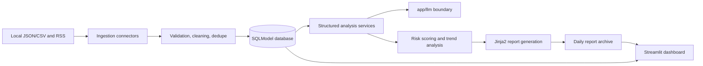

# Architecture

## Overview

The system uses a modular Python architecture:

## Backend

FastAPI is the system API boundary. PR #1 exposes `/health` and a placeholder module route. Later PRs will add ingestion, analysis, risk, report, and evaluation endpoints.

## Database

SQLModel is used for Python typing and SQLAlchemy compatibility. SQLite is the local default through `DATABASE_URL`, while PostgreSQL-compatible connection strings are accepted for later deployment.

Persisted entities include sources, ingestion batches, articles, comments, data quality records, analysis runs, sentiment results, viewpoints, topic summaries, risk insights, recommendations, reports, evaluation runs, and evaluation metrics.

The current repository provides lightweight repository helpers for CRUD-style persistence tests and early services. Full query services can be added only when a downstream module needs them.

## LLM Boundary

All real provider calls must be implemented under `app/llm`. Other modules depend on contracts and client interfaces, not provider SDKs. PR #1 provides a mock client and structured output schemas only.

## Dashboard

Streamlit provides the analyst-facing UI. The dashboard is Chinese-facing and uses backend APIs rather than accessing provider SDKs or databases directly.

## Reporting

Later PRs will assemble report data from database records and render Markdown/HTML through Jinja2. PDF export is intentionally deferred until report templates are stable.
